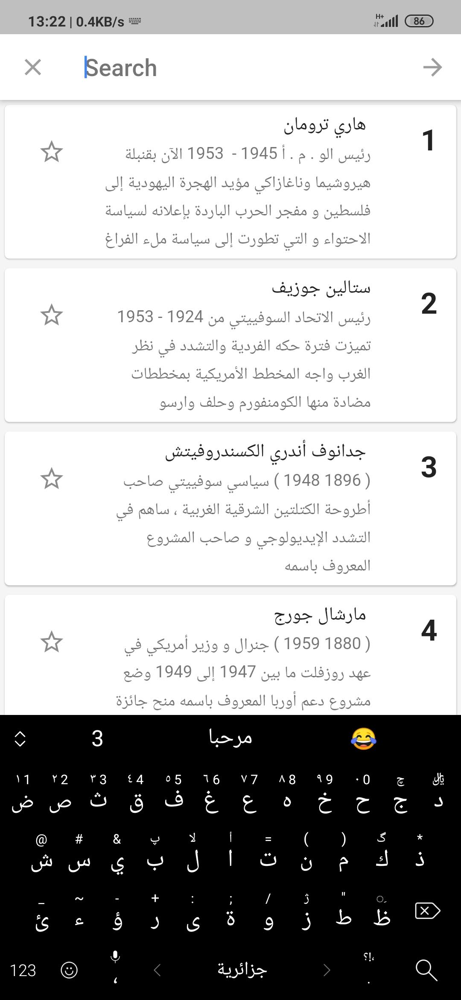
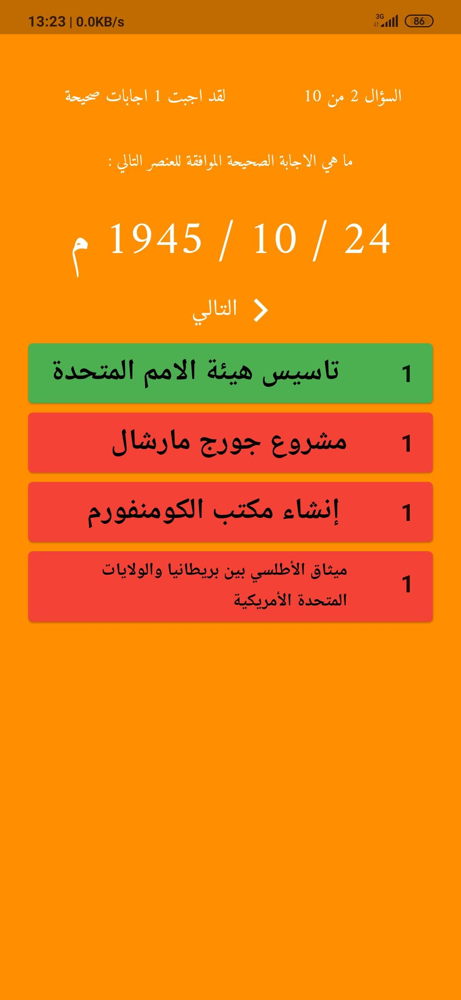

# tarikh19

A history education app called tarikh19 designed to students in algeria, it has courses, quizzes, maps, exams and a lot more.
Over 1K downloads in the [google play store](https://play.google.com/store/apps/details?id=com.tarikh19.tarikh19)

